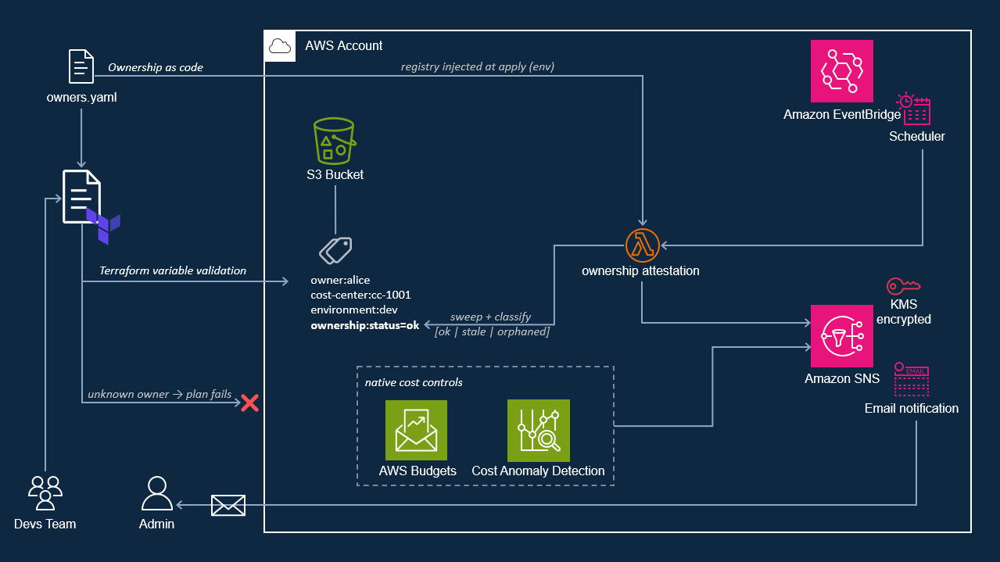

# Ownership & Cost Governance

A focused, reusable AWS Terraform module that keeps the `owner` tag valid and
current over time, and wires AWS-native cost controls (Budgets, Cost Anomaly
Detection, cost-allocation tags) onto a single notification spine.


> **Ownership that stays valid.**
> A reusable Terraform module that gates resource creation on a registered owner and re-checks that ownership stays current, with AWS-native cost controls wired to the same alerts.

## The problem

In every estate I've run, the *owner* tag (if one exists at all) is the first thing to rot.
Usually set once, it passes every audit and stops being true the day that person changes teams or leaves. Attribution and accountability then break silently, and nobody notices until an incident needs an owner, a change needs an approver, or finance asks who is paying.

This module is version 1 of my approach for closing that gap: **accountability that re-validates itself**, married with native cost controls. 

A gate that only admits resources with a registered owner, and a scheduled check that notices when an owner stops being valid. 
Use it as-is, and you have a gatekeeper for your IaC path. 

On the roadmap: it will plug into your JML process so a mover's or leaver's resources flag themselves for reassignment.

## My native-first approach: what to use, wire, or build

How each relevant native capability is handled: use it, wire it in, or build the
missing piece:

| Capability | Native option(s) | Verdict | Notes |
|---|---|---|---|
| Threshold budgets | AWS Budgets | **wire** | Managed service; wrapped directly. |
| Spike detection | Cost Anomaly Detection (free, ML) | **wire** | Detects anomalies that static thresholds do not. |
| Cost attribution | Cost-allocation tags | **wire** | Activates schema tags so spend reaches Cost Explorer/Budgets. |
| Tag value/format at scale | Organizations Tag Policies | **reference** | Validates value shape; org-level, not per-pipeline. |
| Block untagged at creation | SCPs (`aws:RequestTag` deny) | **reference** | Enforces presence at creation, account-wide; scope it (see below). |
| Whole-estate baseline | Control Tower / LZA | **reference** | Multi-account and heavyweight; out of scope for this module. |
| Idle / underused resources | Trusted Advisor, Compute Optimizer | **reference (not built)** | Provided by native services. |
| Approved/golden AMIs | EC2 Allowed AMIs, Config, Image Builder | **reference → separate project** | Largely native; covered by a separate project. |
| **Owner validity + freshness** | None | **BUILD** | No native service checks that an owner resolves to a current identity or re-attests over time. |

## Architecture



The module enforces in two layers, one at plan time and one at runtime:

- **Plan-time gate** (pure Terraform): `terraform plan` **fails** on a missing
  required tag, an invalid `environment`, or an `owner` not in the registry,
  before any AWS call. Governs the IaC path.
- **Ownership attestation** (the custom Lambda): on a schedule, it discovers every
  owner-tagged resource via the Resource Groups Tagging API, *regardless of how
  it was created*, and flags drift. It **only tags and notifies; it never stops,
  deletes, or modifies a resource.**

## Ownership outcomes

| Status | Meaning | Detected by |
|---|---|---|
| `ok` | owner is in the registry and the attestation is current | Lambda (runtime) |
| `stale` | owner is in the registry but the attestation window has expired | Lambda (runtime) |
| `orphaned` | owner is no longer in the registry | Lambda (runtime) |
| *plan rejected* | required tag missing, bad `environment`, or unknown owner | Terraform (plan-time) |

## Usage

The module is provider-agnostic and inherits AWS configuration from the root that
uses it. Instantiate it **once per account**: each instance deploys the full
control plane (topic, Lambda, budget); stacks in the account then apply its
`validated_tags` to their resources:

```hcl
provider "aws" {
  region = "eu-west-1"
  default_tags { tags = { ManagedBy = "Terraform" } }

  # The attestation Lambda writes this tag out of band; without ignore_tags,
  # plans would remove it from Terraform-managed resources.
  ignore_tags { keys = ["ownership:status"] }
}

module "governance" {
  source = "github.com/GPafs/owner-cost-guard?ref=v0.1.0" # pin a release

  notification_email    = "team@example.com"
  monthly_budget_amount = 200

  # Registry defaults to the module's bundled owners.yaml; supply your own:
  # owners_file = abspath("owners.yaml")

  tags = {
    owner       = "alice@example.com" # must resolve to the registry, or the plan fails
    cost-center = "cc-1001"
    environment = "prod"
  }
}

# Apply the validated tags to your own resources.
resource "aws_s3_bucket" "data" {
  bucket_prefix = "team-data-"
  tags          = module.governance.validated_tags
}
```

A complete, runnable demo (the `ok`/`stale`/`orphaned` scenarios) lives in
[`examples/complete/`](examples/complete/). Running cost is ~$1/month (the KMS
key); the remaining components are free tier or negligible.

## Enforcing this in production

The plan-time gate validates ownership for anyone creating resources **through the
module**; it governs the IaC path, not resource creation account-wide. A
production rollout layers three controls:

1. **Presence (org-wide, native; use both).** An AWS Organizations **Service
   Control Policy** denies creation without an `owner` tag (preventive,
   create-time; scope it to specific resource types so it doesn't break
   CloudFormation's create-then-tag). **AWS Config's `required-tags` rule** flags
   resources that exist without the tag (detective, at rest; covers pre-existing
   resources and actions the SCP doesn't enumerate). **Tag Policies** constrain
   the value shape.
2. **Validity on the paved road (this module).** On the IaC path the gate goes
   beyond presence: the `owner` must resolve to a real registry entry.
3. **Freshness over time (this module's Lambda).** The scheduled attestation check
   flags `stale`/`orphaned` ownership regardless of how a resource was created.
   It evaluates resources carrying the `owner` tag; presence is layer 1's concern.

Native controls enforce that a tag is **present**; only the attestation loop checks
the owner is **still a valid, current identity**. That is the gap this module fills.

## Reference

<!-- BEGIN_TF_DOCS -->
## Requirements

| Name | Version |
| ---- | ------- |
| <a name="requirement_terraform"></a> [terraform](#requirement\_terraform) | >= 1.9.0 |
| <a name="requirement_archive"></a> [archive](#requirement\_archive) | ~> 2.0 |
| <a name="requirement_aws"></a> [aws](#requirement\_aws) | ~> 6.0 |

## Providers

| Name | Version |
| ---- | ------- |
| <a name="provider_archive"></a> [archive](#provider\_archive) | 2.8.0 |
| <a name="provider_aws"></a> [aws](#provider\_aws) | 6.51.0 |

## Modules

No modules.

## Resources

| Name | Type |
| ---- | ---- |
| [aws_budgets_budget.monthly](https://registry.terraform.io/providers/hashicorp/aws/latest/docs/resources/budgets_budget) | resource |
| [aws_ce_anomaly_monitor.this](https://registry.terraform.io/providers/hashicorp/aws/latest/docs/resources/ce_anomaly_monitor) | resource |
| [aws_ce_anomaly_subscription.this](https://registry.terraform.io/providers/hashicorp/aws/latest/docs/resources/ce_anomaly_subscription) | resource |
| [aws_ce_cost_allocation_tag.schema](https://registry.terraform.io/providers/hashicorp/aws/latest/docs/resources/ce_cost_allocation_tag) | resource |
| [aws_cloudwatch_log_group.ownership](https://registry.terraform.io/providers/hashicorp/aws/latest/docs/resources/cloudwatch_log_group) | resource |
| [aws_iam_role.ownership_lambda](https://registry.terraform.io/providers/hashicorp/aws/latest/docs/resources/iam_role) | resource |
| [aws_iam_role.scheduler](https://registry.terraform.io/providers/hashicorp/aws/latest/docs/resources/iam_role) | resource |
| [aws_iam_role_policy.ownership_lambda](https://registry.terraform.io/providers/hashicorp/aws/latest/docs/resources/iam_role_policy) | resource |
| [aws_iam_role_policy.scheduler_invoke](https://registry.terraform.io/providers/hashicorp/aws/latest/docs/resources/iam_role_policy) | resource |
| [aws_kms_alias.notifications](https://registry.terraform.io/providers/hashicorp/aws/latest/docs/resources/kms_alias) | resource |
| [aws_kms_key.notifications](https://registry.terraform.io/providers/hashicorp/aws/latest/docs/resources/kms_key) | resource |
| [aws_lambda_function.ownership](https://registry.terraform.io/providers/hashicorp/aws/latest/docs/resources/lambda_function) | resource |
| [aws_scheduler_schedule.ownership](https://registry.terraform.io/providers/hashicorp/aws/latest/docs/resources/scheduler_schedule) | resource |
| [aws_sns_topic.notifications](https://registry.terraform.io/providers/hashicorp/aws/latest/docs/resources/sns_topic) | resource |
| [aws_sns_topic_policy.notifications](https://registry.terraform.io/providers/hashicorp/aws/latest/docs/resources/sns_topic_policy) | resource |
| [aws_sns_topic_subscription.email](https://registry.terraform.io/providers/hashicorp/aws/latest/docs/resources/sns_topic_subscription) | resource |
| [archive_file.ownership](https://registry.terraform.io/providers/hashicorp/archive/latest/docs/data-sources/file) | data source |
| [aws_caller_identity.current](https://registry.terraform.io/providers/hashicorp/aws/latest/docs/data-sources/caller_identity) | data source |
| [aws_iam_policy_document.lambda_assume](https://registry.terraform.io/providers/hashicorp/aws/latest/docs/data-sources/iam_policy_document) | data source |
| [aws_iam_policy_document.notifications_kms](https://registry.terraform.io/providers/hashicorp/aws/latest/docs/data-sources/iam_policy_document) | data source |
| [aws_iam_policy_document.notifications_topic](https://registry.terraform.io/providers/hashicorp/aws/latest/docs/data-sources/iam_policy_document) | data source |
| [aws_iam_policy_document.ownership_lambda](https://registry.terraform.io/providers/hashicorp/aws/latest/docs/data-sources/iam_policy_document) | data source |
| [aws_iam_policy_document.scheduler_assume](https://registry.terraform.io/providers/hashicorp/aws/latest/docs/data-sources/iam_policy_document) | data source |
| [aws_iam_policy_document.scheduler_invoke](https://registry.terraform.io/providers/hashicorp/aws/latest/docs/data-sources/iam_policy_document) | data source |
| [aws_partition.current](https://registry.terraform.io/providers/hashicorp/aws/latest/docs/data-sources/partition) | data source |
| [aws_region.current](https://registry.terraform.io/providers/hashicorp/aws/latest/docs/data-sources/region) | data source |

## Inputs

| Name | Description | Type | Default | Required |
| ---- | ----------- | ---- | ------- | :------: |
| <a name="input_anomaly_impact_threshold"></a> [anomaly\_impact\_threshold](#input\_anomaly\_impact\_threshold) | Minimum absolute anomaly impact, in USD, that triggers a Cost Anomaly Detection alert. | `number` | `100` | no |
| <a name="input_budget_thresholds"></a> [budget\_thresholds](#input\_budget\_thresholds) | Budget notification thresholds, as a percent of the limit, for actual and forecasted spend. | <pre>object({<br/>    actual_warning   = number<br/>    actual_critical  = number<br/>    forecast_warning = number<br/>  })</pre> | <pre>{<br/>  "actual_critical": 100,<br/>  "actual_warning": 80,<br/>  "forecast_warning": 100<br/>}</pre> | no |
| <a name="input_enable_cost_allocation_tags"></a> [enable\_cost\_allocation\_tags](#input\_enable\_cost\_allocation\_tags) | Toggle activation of the schema keys as cost-allocation tags. Requires the management/payer account and that the keys have already appeared in billing data (~24h); leave off on fresh/standalone accounts. | `bool` | `true` | no |
| <a name="input_enable_cost_anomaly_detection"></a> [enable\_cost\_anomaly\_detection](#input\_enable\_cost\_anomaly\_detection) | Toggle the Cost Anomaly Detection monitor + subscription (free, ML-based spike detection). Uses a custom, account-scoped monitor, so it coexists with the account's default monitor. | `bool` | `true` | no |
| <a name="input_governed_tagging_actions"></a> [governed\_tagging\_actions](#input\_governed\_tagging\_actions) | Service tagging permissions the Lambda may use to write the ownership:status tag. Defaults to S3; add each governed service's action (e.g. ec2:CreateTags, rds:AddTagsToResource) to extend write-back. The written key is constrained to ownership:status regardless. | `list(string)` | <pre>[<br/>  "s3:GetBucketTagging",<br/>  "s3:PutBucketTagging"<br/>]</pre> | no |
| <a name="input_log_retention_days"></a> [log\_retention\_days](#input\_log\_retention\_days) | CloudWatch log retention for the attestation Lambda. | `number` | `14` | no |
| <a name="input_monthly_budget_amount"></a> [monthly\_budget\_amount](#input\_monthly\_budget\_amount) | Monthly cost budget limit, in USD. | `number` | n/a | yes |
| <a name="input_name_prefix"></a> [name\_prefix](#input\_name\_prefix) | Prefix for named resources (SNS topic, KMS alias, ...). Ownership-first, combining both governance concerns. | `string` | `"ownership-n-cost-governance"` | no |
| <a name="input_notification_email"></a> [notification\_email](#input\_notification\_email) | Email subscribed to the SNS notification topic. The recipient must confirm via the link AWS sends before alerts are delivered. | `string` | n/a | yes |
| <a name="input_owners_file"></a> [owners\_file](#input\_owners\_file) | Path to the ownership registry YAML, the flat-file identity source used by<br/>the plan-time gate and the attestation Lambda. Each entry needs id, team,<br/>cost\_center, attested\_on (ISO date), and valid\_for\_days. Defaults to the<br/>module's bundled owners.yaml; pass a path from the calling configuration<br/>(e.g. abspath("owners.yaml")) to supply your own registry. | `string` | `null` | no |
| <a name="input_ownership_schedule"></a> [ownership\_schedule](#input\_ownership\_schedule) | EventBridge Scheduler expression for the ownership attestation run (cron/rate/at). | `string` | `"cron(0 7 * * ? *)"` | no |
| <a name="input_tag_resource_types"></a> [tag\_resource\_types](#input\_tag\_resource\_types) | Resource-type filters the attestation Lambda evaluates (e.g. ["s3"]). Empty = all taggable resources. | `list(string)` | `[]` | no |
| <a name="input_tags"></a> [tags](#input\_tags) | Accountability tags applied to governed resources, validated at plan time.<br/>Must include: owner (must resolve to an id in owners\_file), cost-center,<br/>and environment (one of dev\|staging\|prod). Surfaced to consumers via the<br/>validated\_tags output. | `map(string)` | n/a | yes |

## Outputs

| Name | Description |
| ---- | ----------- |
| <a name="output_budget_name"></a> [budget\_name](#output\_budget\_name) | Name of the monthly cost budget. |
| <a name="output_ownership_lambda_arn"></a> [ownership\_lambda\_arn](#output\_ownership\_lambda\_arn) | ARN of the ownership attestation Lambda. |
| <a name="output_sns_topic_arn"></a> [sns\_topic\_arn](#output\_sns\_topic\_arn) | ARN of the notification spine (ownership-attestation findings, budgets, anomaly alerts). |
| <a name="output_validated_tags"></a> [validated\_tags](#output\_validated\_tags) | The plan-time-validated accountability tags. Consumers apply these to governed resources. |
<!-- END_TF_DOCS -->

## Verification

All checks are read-only and run in CI on every push (no AWS credentials; the
test mocks the provider). CI never deploys; applying is a separate manual step.

```bash
terraform fmt -check -recursive
terraform init -backend=false && terraform validate
tflint
checkov -d . --framework terraform
terraform test        # proves the plan-time gate fails closed
```

## Non-goals & future directions

**Out of scope:**

- Idle/waste detection: covered by native services (Trusted Advisor / Compute Optimizer).
- Multi-account / Organizations rollout: out of scope for this module.
- FinOps dashboards and auto-remediation: the module flags and notifies only.

**Future directions:**

- **Dual ownership (next release)**: a business owner and a technical owner per
  resource, validated and attested independently against the same registry.
- **Pluggable identity source**: owner resolution sits behind a single seam
  (`FlatFileIdentitySource`); the next step formalizes it into an `IdentitySource`
  interface with an **IAM Identity Center** adapter, making the registry live
  identity truth rather than a flat file.
- **Identity-lifecycle (JML) integration**: event-driven off joiner/mover/leaver.
  A leaver's resources flag `orphaned` automatically and route to the manager/team
  for reassignment; the freshness window drives periodic recertification.
  Detection and routing only; never auto-delete.
- **Least-privilege recertification**: the same attestation loop applied to
  access, reusing Identity Center attributes.

## Design decisions & trade-offs


| Decision | Alternative | Reasoning |
| -------- | ----------- | --------- |
| **Native-first, not from-scratch.** | Build tagging + budgets + idle   detection from scratch. | Native services and mature OSS modules already cover these. |
| **Ownership freshness, not just presence.** | Require `owner` to be non-empty. | A presence check stays green after the owner leaves; validity and freshness are the uncovered part. |
| **Flat-file registry behind a seam.** | A database or live identity provider. | The flat file is git-auditable and re-attested by PR; the seam leaves room for IAM Identity Center. |
| **Lambda + Scheduler, not AWS Config.** | AWS Config custom rule | Config evaluates configuration state, not registry membership or attestation age. |
| **Gate via Terraform variable validation.** | External policy engine such as OPA or Sentinel | Runs before any AWS call: testable without credentials, and needs no external policy engine. |
| **One SNS hub; flag, never delete.** | A separate SNS topic for each signal | A single notification spine for all signals; auto-remediation is out of scope. |

## License

MIT. See [LICENSE](LICENSE).
