# Complete example

A runnable demo of the ownership-and-cost-governance module. It is also the
**canonical deploy root**: the module is provider-agnostic, so this folder
supplies the AWS provider (region + `default_tags`) and plugs the module in.

What it deploys:

- the governance control plane (KMS-encrypted SNS topic, AWS Budgets, Cost
  Anomaly Detection, and the scheduled ownership-attestation Lambda), and
- two demo S3 buckets that exercise the ownership outcomes.

## The scenarios

| Scenario | How it's set up here | Result |
|---|---|---|
| **`ok`** | `ok_demo` bucket, owner `alice@example.com` (current in `owners.yaml`) | Lambda tags it `ownership:status = ok` |
| **`stale`** | `stale_demo` bucket, owner `bob@example.com` (in `owners.yaml`, attestation expired) | Lambda tags it `stale` and emails a finding |
| **`orphaned`** | remove `bob` from `owners.yaml` and re-apply | on the next run `bob`'s bucket becomes `orphaned` |
| **plan rejected** | set the module's `owner` to an unlisted value | `terraform plan` **fails** (see below) |

## Plan-time rejection (the gate)

Change the module's `owner` to something not in `owners.yaml` (e.g.
`ghost@example.com`) and the plan fails before anything is created, with no AWS
credentials required:

```text
Error: Invalid value for variable

  on main.tf line 17, in module "governance":
  17:   tags = {

tags["owner"] must resolve to an id in the ownership registry (owners_file).
This was checked by the validation rule at ..\..\tagging.tf:45,3-13.
```

## Deploy, step by step

> Requires AWS credentials (see the deploy runbook). Runs in free tier (empty S3
> buckets + tags). Nothing auto-applies.

1. **Set your email** so alerts reach you (gitignored; never commit a real one):
   ```bash
   cd examples/complete
   printf 'notification_email = "you@example.com"\n' > terraform.tfvars
   ```
2. **Deploy:**
   ```bash
   terraform init
   terraform plan      # review
   terraform apply     # creates the control plane + demo buckets
   ```
3. **Confirm** the SNS subscription email AWS sends you.
4. Continue with **See it work**, below.

### Cost Explorer features: read before enabling

- **Cost Anomaly Detection is ON and deploys cleanly.** It uses a custom,
  account-scoped monitor, so it coexists with the default monitor AWS creates.
- **Cost-allocation-tag activation is OFF** (`enable_cost_allocation_tags = false`).
  AWS only activates a cost-allocation tag **after the key has appeared in your
  billing data**, up to **~24 hours** after the tagged resources exist, and from
  the **management/payer account**. Enabling it on a first deploy makes `apply`
  **fail** with `Tag keys not found`.

  To enable it: deploy first, wait ~24h, confirm the keys appear under **Billing →
  Cost allocation tags**, then set `enable_cost_allocation_tags = true` in your
  `terraform.tfvars` and run `terraform apply` again:

  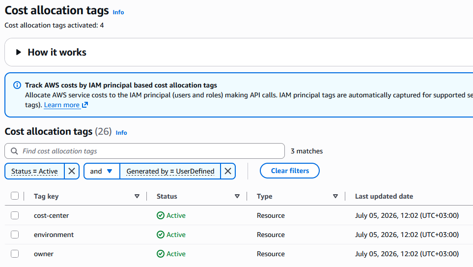

## See it work

1. **Confirm the email subscription.** AWS emails a confirmation link to
   `notification_email`; click it so findings can be delivered.
2. **Run an attestation on demand** (instead of waiting for the daily schedule):
   invoke the Lambda from the console, or note its ARN from
   `terraform output ownership_lambda_arn`. The daily schedule that runs it:

   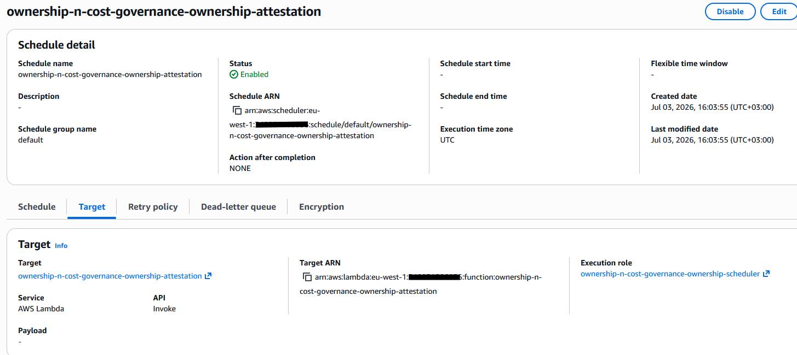
3. **Check the buckets' status tag.** `ok_demo` shows `ownership:status = ok`;
   `stale_demo` shows `stale`, and a findings email arrives:

   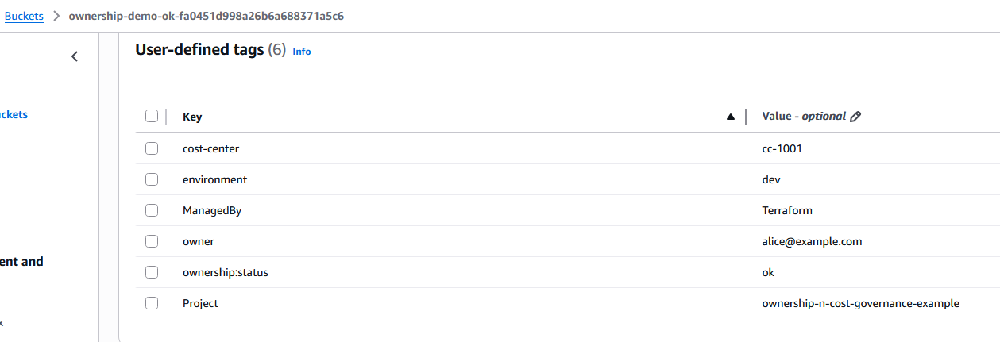
   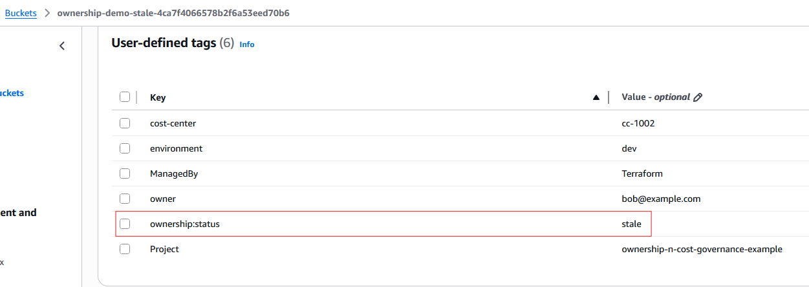
   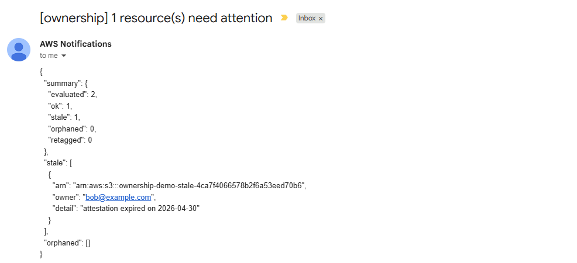
4. **Try `orphaned`:** remove `bob` from `owners.yaml`, `terraform apply` (to
   refresh the Lambda's registry), invoke the Lambda again; `bob`'s bucket flips
   to `orphaned`:

   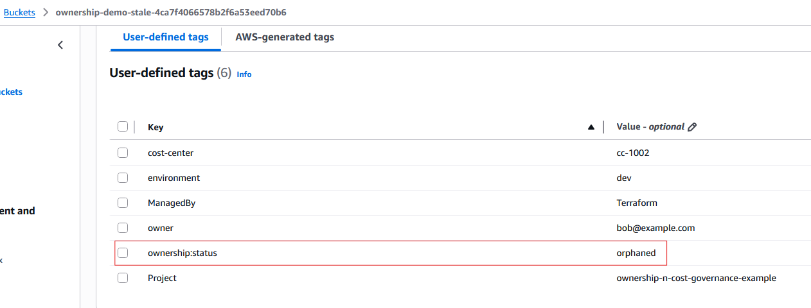

<details>
<summary>More deployment evidence: cost controls, encryption, and logs</summary>

The monthly budget and the account-scoped anomaly monitor, wired to the topic:

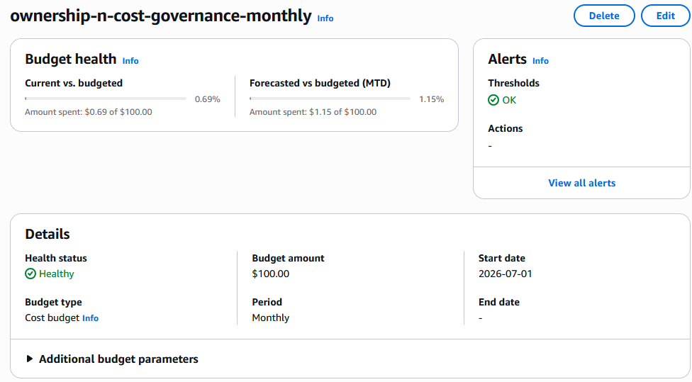
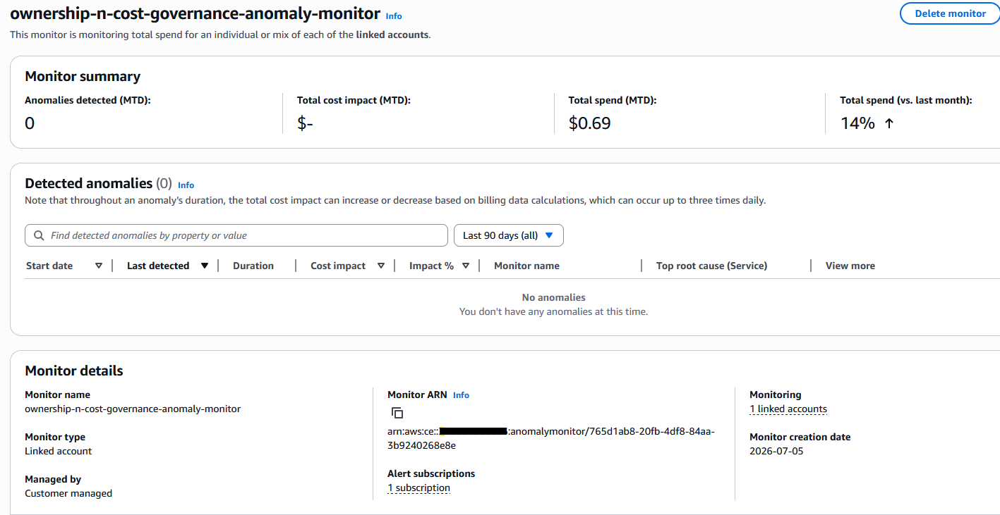

The notification topic is encrypted with the module's customer-managed key:

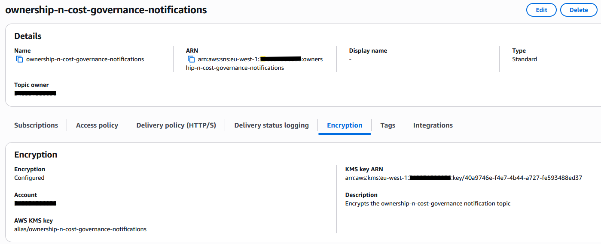

The Lambda's structured per-resource decisions and run summary in CloudWatch,
for the stale and orphaned runs:

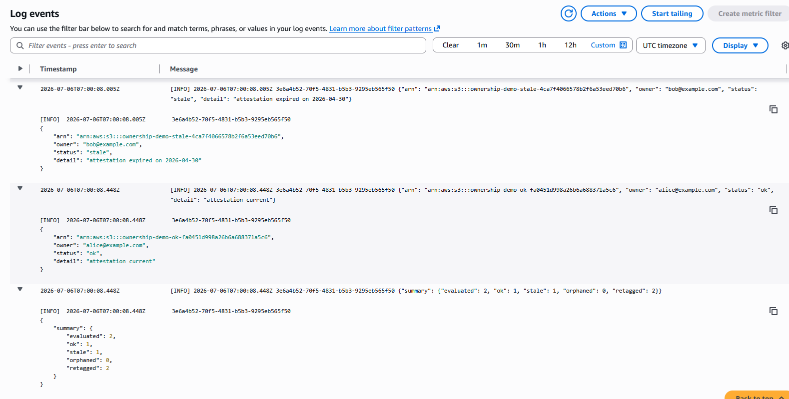
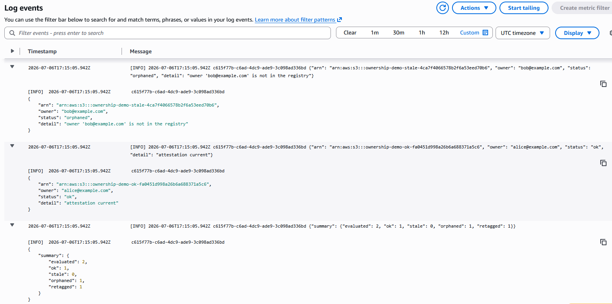

</details>

## Tear down

```bash
terraform destroy
```

Nothing here stops, deletes, or modifies resources on its own; the Lambda only
tags and notifies. Teardown is a deliberate manual step.
